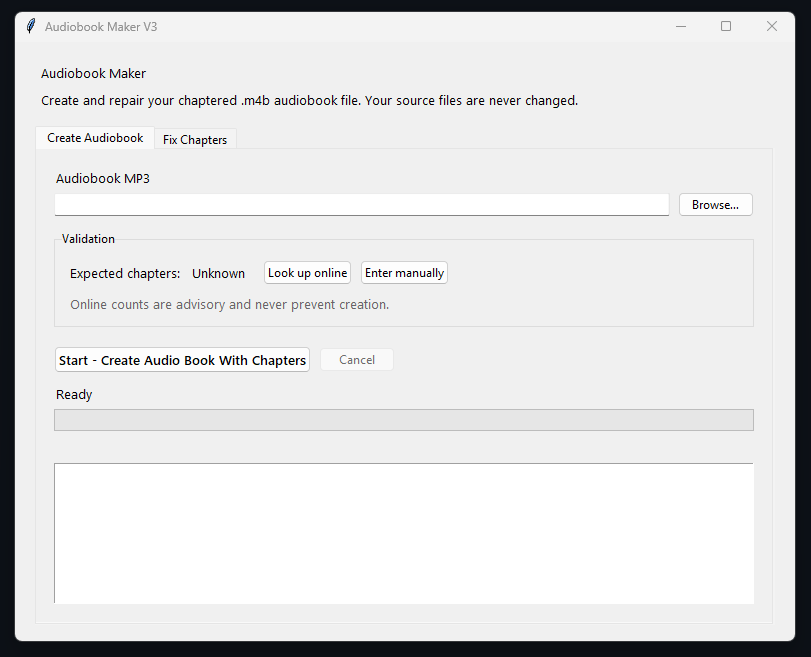
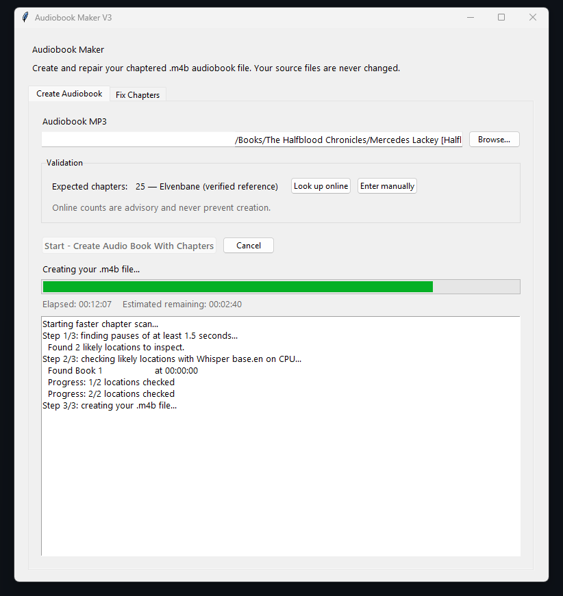
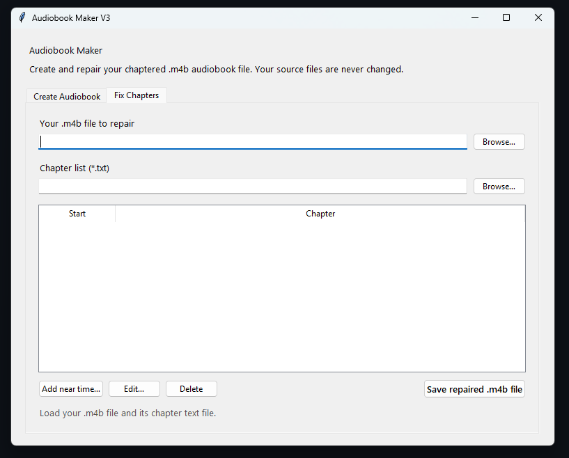

# Audiobook Chapter Maker

A simple Windows app that detects spoken chapter headings in audiobook MP3s and creates chaptered `.m4b` audiobook files.

## Features

- Clean desktop interface for nontechnical users
- Automatic reuse of valid chapter markers already embedded in an MP3, avoiding an unnecessary speech scan
- Faster local Whisper scanning around likely chapter breaks
- Local speech recognition after the initial model download
- Standalone chapter-reference lookup using MP3 tags, filenames/folders, Open Library, Google Books, and a downloadable community catalogue
- Local reference caching with chapter numbers, titles, and printed starting pages when available
- Missing-chapter reporting
- One scan per run—there are no automatic repeat scans
- If validation is incomplete, a simple popup offers optional higher-accuracy or shorter-pause retry settings
- Early safety stop when chapter discovery is far behind the expected pace after two hours
- Recognition of word-only announcements such as `Seven.` as well as `Chapter Seven`
- Gap-tolerant validation: one missed heading no longer hides every later chapter
- Verified print-page fallback for supported editions that announce page positions instead of chapter headings
- Reusable scan evidence beside the MP3, allowing later matching improvements or reference changes without another full transcription
- Interrupted or early-stopped scans are marked as partial and resume from the saved position instead of being mistaken for a completed scan
- Cross-checking between page estimates and nearby spoken numbers to replace rough estimates with the actual narrated boundary
- Add, edit, rename, or remove chapter markers
- Scan one minute near an approximate timestamp to recover a missing chapter
- Repair an existing `.m4b` without re-encoding its audio
- Preserves the original MP3 and earlier audiobook files
- Caps AAC output at the source MP3 bitrate (and 96 kbps maximum), avoiding larger files that cannot improve the original audio
- Silent Windows launcher with progress shown inside the app
- Real progress and activity indicators, elapsed time, and estimated time remaining
- Long-book warning, cancellation, and protection against accidental closing
- Visible Report a Bug button linked to a guided GitHub issue form

## Screenshots

*The Create Audiobook screen when first opened, ready for the user to choose an MP3 and optionally validate the expected chapter count.*

*An audiobook being processed, with the current stage, progress bar, elapsed time, estimated remaining time, detected headings, and Cancel button visible.*

*The Fix Chapters screen, where users can load their `.m4b` and chapter-list files, then add, edit, delete, or save repaired chapter markers.*

## Windows quick start

1. Download or clone the repository.
2. Open the `launchers` folder.
3. Double-click **Start Audiobook Maker V3.vbs**.
4. Choose an audiobook MP3 and follow the prompts.

The first run checks for Python and FFmpeg and creates a private Python environment. Whisper components and the speech model require an internet connection the first time they are installed or downloaded.

When an MP3 is selected, the app checks it locally before attempting an online lookup. If it already contains valid chapter markers, their count is displayed immediately and the app creates the `.m4b` without online validation or speech recognition. Online chapter information is only supporting evidence for files that do not already contain usable markers.

## Requirements

- Windows 10 or 11
- Python 3.9 or newer; Python 3.11 or 3.12 is recommended
- FFmpeg and ffprobe
- Several GB of free disk space

## GPU acceleration

The Processor menu offers **Automatic**, **Require NVIDIA GPU**, and **CPU only**. The **Test NVIDIA GPU** button performs a real Whisper transcription test. Automatic clearly reports the active processor; Require NVIDIA GPU stops with setup guidance instead of silently using the CPU.

Current faster-whisper GPU releases require an NVIDIA CUDA-capable GPU together with CUDA 12 cuBLAS and cuDNN 9 libraries available on the Windows PATH. An ordinary GPU driver alone may not be sufficient. See the [faster-whisper GPU requirements](https://github.com/SYSTRAN/faster-whisper#gpu).

AMD acceleration is automatic. On an AMD computer, the app downloads a pinned Vulkan-enabled `whisper.cpp` engine and GGML English model on first use, verifies their SHA-256 checksums, installs them under Local AppData, and performs a real Vulkan test. Subsequent runs reuse those files. AMD mode scans the full audiobook in manageable sections.

If a scan stops early because too few headings were recognized in the first two hours, its evidence is saved as partial. A later retry keeps those results and continues after the two-hour point. Saved modest-confidence headings can also be accepted when their number, order, timing, and verified expected chapter count support them.

The pinned Windows engine comes from [Lemonade SDK's AMD-focused whisper.cpp release](https://github.com/lemonade-sdk/whisper.cpp-rocm/releases/tag/v1.8.4), and the model comes from the [official whisper.cpp model repository](https://huggingface.co/ggerganov/whisper.cpp). See the [whisper.cpp Vulkan documentation](https://github.com/ggml-org/whisper.cpp#vulkan-gpu-support).

## Reporting bugs

Use the visible **Report a Bug** button in the app. It opens a guided GitHub issue form in the browser so reports appear directly in this repository. A GitHub account is required to submit the issue. Do not attach copyrighted audiobook audio.

## Privacy

Audio processing and opening-audio identification run locally. The application never uploads audiobook audio and does not call ChatGPT or another cloud AI service. The optional book-information lookup sends text metadata inferred from MP3 tags, filenames/folders, or the locally transcribed opening to the project catalogue, Open Library, and Google Books. Successful references are cached under Local AppData.

Creating a new `.m4b` requires converting MP3 audio to AAC for broad audiobook-player compatibility. The app reads the source audio bitrate and never selects a higher output bitrate; it also caps audiobook output at 96 kbps. Editing chapter markers in an existing `.m4b` uses stream copying and does not re-encode its audio.

## Current status

This is an early public version under active development. Verify generated chapter lists before relying on them.
