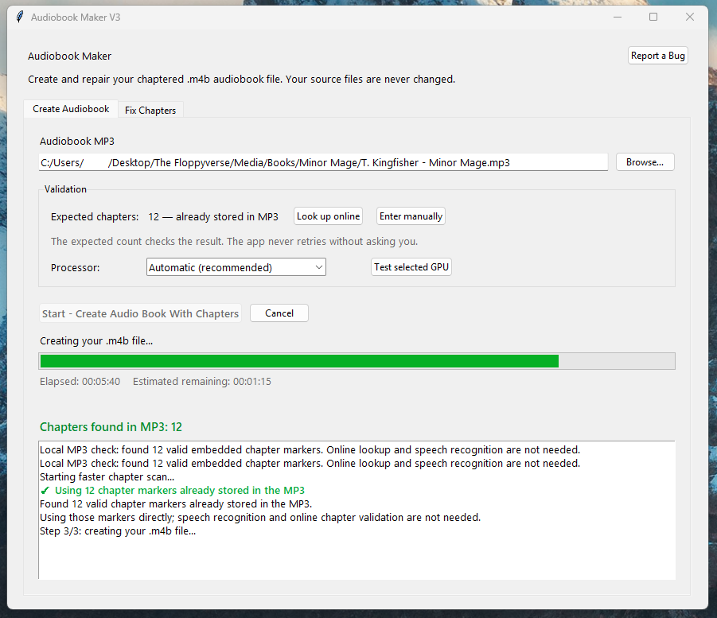
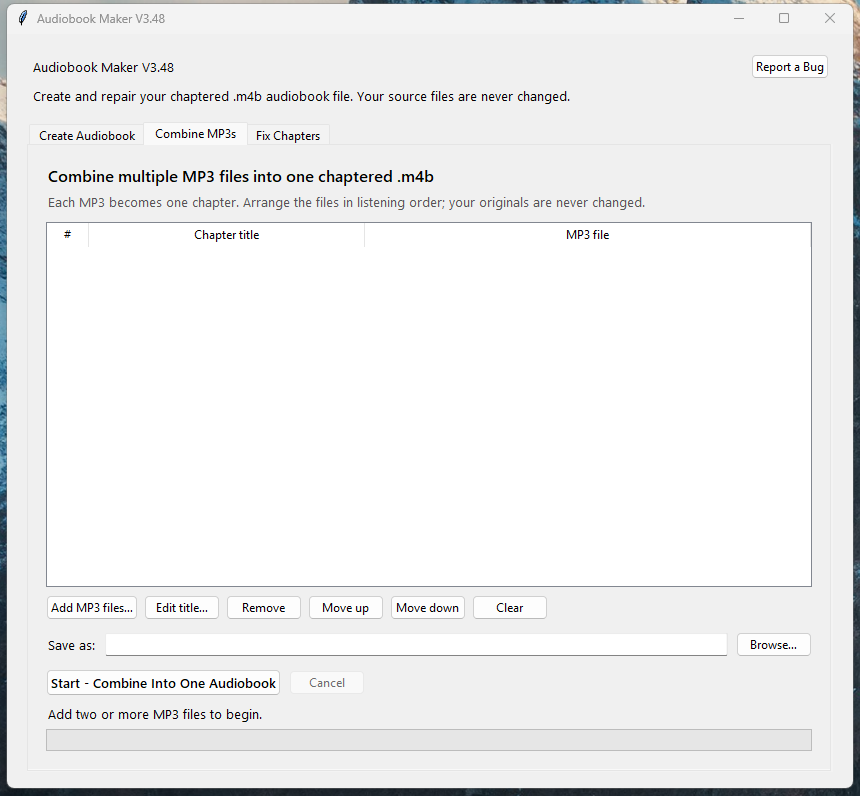
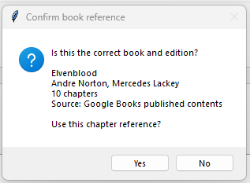
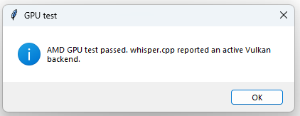
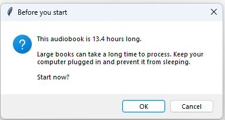
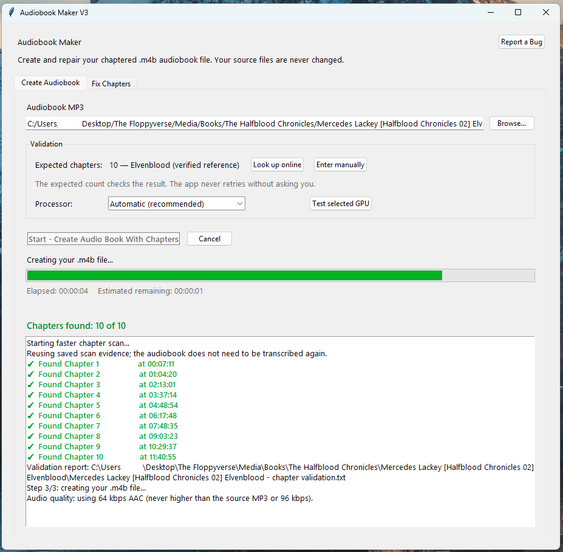
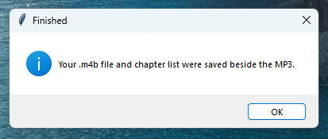

# Audiobook Chapter Maker

A simple Windows app that detects spoken chapter headings in audiobook MP3s and creates chaptered `.m4b` audiobook files.

**Current application version: V3.49**

## ✨ Features

### 🎧 Finds chapters intelligently

- Checks the MP3 first and automatically reuses valid embedded chapter markers
- Recognizes headings such as `Chapter Seven`, `Seven.`, and headings joined to nearby narration
- Scans likely chapter breaks with local Whisper speech recognition
- Cross-checks spoken numbers, surrounding context, silence, timing, and chapter order
- Supports verified print-page estimates when a recording announces page positions instead of chapter headings

### 🌐 Adds supporting book information

- Identifies books from MP3 tags, filenames, folders, or a locally transcribed opening
- Looks for chapter counts, titles, and printed starting pages through the community catalogue, Open Library, and Google Books
- Caches successful references locally for later use
- Uses online information as supporting evidence—the audiobook audio is never uploaded

### ✅ Validates before creating

- Reports missing chapters and keeps later valid chapters even when one heading is missed
- Runs only one scan at a time and never retries without permission
- Offers optional higher-accuracy or shorter-pause settings when a scan is incomplete
- Stops early when chapter discovery is far behind the expected pace after two hours
- Saves partial evidence and resumes from the saved position instead of repeating completed work

### ✏️ Makes chapters easy to repair

- Combines multiple MP3 files into one `.m4b`, using each file as a chapter
- Sorts selected files naturally and lets you reorder them or edit their chapter titles
- Add, edit, rename, or remove chapter markers
- Scan one minute near an approximate timestamp to recover a missing chapter
- Repair an existing `.m4b` without re-encoding its audio
- Recalculate matches from saved scan evidence without transcribing the full book again

### ⚡ Uses your computer efficiently

- Supports NVIDIA CUDA, AMD Vulkan, and CPU processing
- Keeps speech recognition local after the initial engine and model downloads
- Caps AAC output at the source MP3 bitrate and 96 kbps maximum
- Avoids wasting storage on a bitrate that cannot improve the original recording

### 🛡️ Designed for everyday use

- Clean desktop interface for nontechnical users
- Preserves the original MP3 and earlier audiobook files
- Silent Windows launcher with progress shown inside the app
- Shows live chapter discoveries, progress, elapsed time, and estimated time remaining
- Long-book warning, cancellation, and protection against accidental closing
- Visible **Report a Bug** button linked to a guided GitHub issue form

## 🖼️ Guided walkthrough

### 1. 🎧 Use chapters already stored in the MP3

*After you select an MP3, the app checks it locally first. Minor Mage already contains 12 valid markers, so the app skips online validation and speech recognition and proceeds directly to creating the `.m4b`.*

### 2. 📚 Combine multiple MP3 files into one audiobook

*Use this screen when a book is supplied as several MP3 files. Add the files, review their natural listening order, edit chapter titles if needed, choose where to save, and create one chaptered `.m4b`.*

### 3. 🔎 Confirm an online book reference when needed

*If the MP3 has no embedded markers, the app can look for a published table of contents. Confirm the title, authors, chapter count, and source before using the reference.*

### 4. ⚡ Verify AMD GPU acceleration

*The GPU test confirms that the local speech-recognition engine can use an AMD graphics card through Vulkan.*

### 5. ⏳ Review the long-book warning

*Long audiobooks display a clear warning before processing begins. Keep the computer plugged in and prevent it from sleeping.*

### 6. ✅ Watch verified chapters appear

*Detected chapters appear in bright green with timestamps. The counter shows progress against the verified reference, while the lower log reports validation, encoding progress, and the chosen audio bitrate.*

### 7. 💾 Find the finished files beside the MP3

*When processing finishes, the app confirms that the `.m4b` and readable chapter list were saved in the same folder as the original MP3.*

## 🚀 Windows quick start

1. Download or clone the repository.
2. Open the `launchers` folder.
3. Double-click **Start Audiobook Maker V3.vbs**.
4. Choose an audiobook MP3 and follow the prompts.

The downloadable V3.49 ZIP has a simplified layout. Double-click **Start Audiobook Maker.vbs** at the top level. The technical scripts and private Python environment stay inside the `app` folder, which ordinary users can ignore.

## 📚 Combining multiple MP3 files

Use **Combine MP3s** when an audiobook is already divided into separate MP3 tracks. This is faster and more reliable than listening for spoken headings because every input file becomes a known chapter boundary.

1. Open **Combine MP3s**.
2. Select **Add MP3 files…** and choose all parts of the book.
3. Check the listening order. Numbered filenames are sorted naturally, and **Move up** or **Move down** can correct the order.
4. Double-click a row or select **Edit title…** to change the chapter name.
5. Choose the finished `.m4b` filename and location.
6. Select **Start - Combine Into One Audiobook**.

The app turns each MP3 into one chapter, preserves every original file, and shows conversion progress. It uses no more than the lowest source bitrate and never exceeds 96 kbps, avoiding a larger output that cannot improve the original audio. Keeping the MP3 files on a computer as the archive and using the single `.m4b` on a phone is generally the most convenient arrangement.

The first run checks for Python and FFmpeg and creates a private Python environment. Whisper components and the speech model require an internet connection the first time they are installed or downloaded.

When an MP3 is selected, the app checks it locally before attempting an online lookup. If it already contains valid chapter markers, their count is displayed immediately and the app creates the `.m4b` without online validation or speech recognition. Online chapter information is only supporting evidence for files that do not already contain usable markers.

## 📋 Requirements

- Windows 10 or 11
- Python 3.9 or newer; Python 3.11 or 3.12 is recommended
- FFmpeg and ffprobe
- Several GB of free disk space

## ⚡ GPU acceleration

The Processor menu offers **Automatic**, **Require NVIDIA GPU**, and **CPU only**. The **Test NVIDIA GPU** button performs a real Whisper transcription test. Automatic clearly reports the active processor; Require NVIDIA GPU stops with setup guidance instead of silently using the CPU.

Current faster-whisper GPU releases require an NVIDIA CUDA-capable GPU together with CUDA 12 cuBLAS and cuDNN 9 libraries available on the Windows PATH. An ordinary GPU driver alone may not be sufficient. See the [faster-whisper GPU requirements](https://github.com/SYSTRAN/faster-whisper#gpu).

AMD acceleration is automatic. On an AMD computer, the app downloads a pinned Vulkan-enabled `whisper.cpp` engine and GGML English model on first use, verifies their SHA-256 checksums, installs them under Local AppData, and performs a real Vulkan test. Subsequent runs reuse those files. AMD mode scans the full audiobook in manageable sections.

If a scan stops early because too few headings were recognized in the first two hours, its evidence is saved as partial. A later retry keeps those results and continues after the two-hour point. Saved modest-confidence headings can also be accepted when their number, order, timing, and verified expected chapter count support them.

The pinned Windows engine comes from [Lemonade SDK's AMD-focused whisper.cpp release](https://github.com/lemonade-sdk/whisper.cpp-rocm/releases/tag/v1.8.4), and the model comes from the [official whisper.cpp model repository](https://huggingface.co/ggerganov/whisper.cpp). See the [whisper.cpp Vulkan documentation](https://github.com/ggml-org/whisper.cpp#vulkan-gpu-support).

## 🐞 Reporting bugs

Use the visible **Report a Bug** button in the app. It opens a guided GitHub issue form in the browser so reports appear directly in this repository. A GitHub account is required to submit the issue. Do not attach copyrighted audiobook audio.

## 🔒 Privacy

Audio processing and opening-audio identification run locally. The application never uploads audiobook audio and does not call ChatGPT or another cloud AI service. The optional book-information lookup sends text metadata inferred from MP3 tags, filenames/folders, or the locally transcribed opening to the project catalogue, Open Library, and Google Books. Successful references are cached under Local AppData.

Creating a new `.m4b` requires converting MP3 audio to AAC for broad audiobook-player compatibility. The app reads the source audio bitrate and never selects a higher output bitrate; it also caps audiobook output at 96 kbps. Editing chapter markers in an existing `.m4b` uses stream copying and does not re-encode its audio.

## 🚧 Current status

This is an early public version under active development. Verify generated chapter lists before relying on them.
